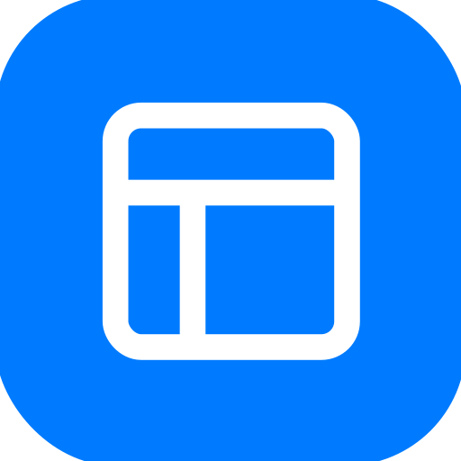

# Kaya Developer Tools

A collection of lightweight development tools for .NET applications that provide automatic discovery and interactive testing capabilities.

## Tools

###  Kaya.ApiExplorer
Swagger-like API documentation tool that automatically scans HTTP endpoints and displays them in an interactive UI.

**Features:**
- Automatic Discovery - Scans controllers and endpoints using reflection
- Interactive UI - Test endpoints directly from the browser with real-time responses
- Authentication - Support for Bearer tokens, API keys, and OAuth 2.0
- SignalR Debugging - Real-time hub testing with method invocation and event monitoring
- XML Documentation - Automatically reads and displays your code comments
- Code Export - Generate request snippets in multiple programming languages
- Performance Metrics - Track request duration and response size

📖 [Full Documentation](src/Kaya.ApiExplorer/README.md)

###   Kaya.GrpcExplorer
gRPC service explorer that uses Server Reflection to discover and test gRPC services.
**Features:**
- Automatic Service Discovery - Uses gRPC Server Reflection to enumerate services and methods
- All RPC Types - Support for Unary, Server Streaming, Client Streaming, and Bidirectional Streaming
- Protobuf Schema - Automatically generates JSON schemas from Protobuf message definitions
- Interactive Testing - Execute gRPC methods with JSON payloads directly from the browser
- Server Configuration - Connect to local or remote gRPC servers with custom metadata
- Authentication - Support for metadata-based authentication (Bearer tokens, API keys)
- Streaming Support - View streaming responses with pagination for large message volumes

📖 [Full Documentation](src/Kaya.GrpcExplorer/README.md)

###  Kaya.McpServer
MCP stdio server for invoking HTTP APIs, gRPC methods, and SignalR hubs from MCP hosts (Copilot, Cursor, Claude).

**Features:**
- MCP Tool Surface - HTTP API, gRPC method, and SignalR hub invocation tools exposed via MCP
- Host Integration - Works with MCP-capable clients over stdio transport
- Flexible Configuration - Supports command args, env vars, and JSON config file

📖 [Full Documentation](src/Kaya.McpServer/README.md)

## License

This project is licensed under the MIT License - see the LICENSE file for details.